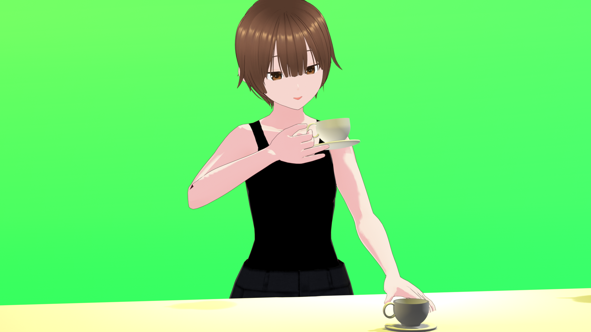

# Real-time Markerless Motion Capture (OAK-D → Blender Avatar)

A lightweight, real-time, **vision-based** motion capture pipeline that streams human motion from an **OAK-D S2** camera into a **VRoid/Blender** avatar.  
Features: full-body pose (upper/lower body), **hand articulation** (finger curls), **head pose** (yaw/pitch/roll), **basic facial expressions**, and **stereo-depth fusion** for better front/back disambiguation. End-to-end latency is instrumented and reported.

> Demo targets: interactive avatar control; future directions include **responsive AI avatars** and **humanoid robot** control.


---

## ✨ Features
- **Markerless** motion capture (no suits/markers).
- **Stereo depth fusion** (median pooling + 3D back-projection).
- **Stabilization stack**: OneEuro smoothing, visibility/velocity gating, **bone-length projection**, hinge stabilization, **angle clamping**, Slerp with time-constant.
- **Hands** (finger curls), **Head** (YPR), **Expressions** (blink, mouth open, smile, brow up).
- **Latency measurement**: camera timestamp vs. Blender apply time, CSV export.
- **Accessible**: consumer hardware + Python + Blender.

---

## 📦 Installation

### Option A: pip
```bash
python -m venv venv
# Windows:
venv\Scripts\activate
# macOS/Linux:
source venv/bin/activate

pip install -r requirements.txt
```
### Option B: conda
```bash
conda env create -f environment.yml
conda activate oakd_blender
```

## ▶️ Quick Start

### 1 Run the OAK-D Sender
```bash
cd sender
python oakd_sender.py --ip 127.0.0.1 --port 9000 --k 5 --alpha 0.2 \
  --det 0.35 --track 0.35 --flip \
  # optional toggles:
  # --no-depth    # disable StereoDepth fallback to MP pseudo-3D
  # --no-hands    # disable finger curls
  # --no-head     # disable head YPR
  # --no-expr     # disable facial expression metrics
```
### Common flags

--k: median pooling radius for depth (patch size = 2k+1). Try 5 or 7 for smoother depth.

--flip: mirror selfie-view.

--alpha: OneEuro smoothing factor for pose vectors.

### 2 Run the Blender Receiver
1. Open your VRoid avatar .blend.

2. Select the armature object (e.g., Armature) and switch to Pose Mode.

3. Text Editor → open blender/blender_receiver.py → Run Script.

4. Console should show:
```csharp
[Receiver] Listening UDP on 127.0.0.1:9000
[Receiver] Timer registered @60.0Hz. Ready ✓
```
5. Move in front of camera — avatar follows.


#### Notes

If you see missing bones, update BONE_MAP and finger bone names in blender_receiver.py to match your rig.

Port already in use? Change UDP_PORT in both sender and receiver to a free port.

## 🧪 Latency Measurement

1. Open your VRoid avatar .blend.

2. Select the armature object (e.g., Armature) and switch to Pose Mode.


3. Text Editor → open blender/blender_receiver.py → Run Script.


4. Console should show:
```csharp
[Receiver] Listening UDP on 127.0.0.1:9000
[Receiver] Timer registered @60.0Hz. Ready ✓
```

## Latency Measurement

We evaluate end-to-end latency from the camera to the avatar using the following formula:

$$
L_{\text{cam→avatar}} = t_{\text{apply}} - (t_{\text{dev}} + \Delta)
$$

Where:

- \( t_{\text{dev}} \): device timestamp at capture (from OAK-D)
- \( \Delta \): device–host clock offset (estimated on first frame)
- \( t_{\text{apply}} \): host-side timestamp when Blender applies the pose

## 📊 Analysis Notebook 
Notebook: 
```bash 
notebooks/latency_analysis.ipynb 
```
Contents:

Summary table (mean, median, p95 + 95% CI)

CDF plot with p95 marker

Scatter plot (per-frame latency spikes)

(Optional) condition comparison (e.g., hands/head on vs off)

Run:
```bash 
jupyter lab
# open notebooks/latency_analysis.ipynb
```
## 🖐️ Hand & Head & Expressions

Hands: finger curls ∈ [0,1] fed to finger bone chains (3 joints per finger).

Head: yaw/pitch/roll estimated from face landmarks; mapped to head bone Euler.

Expressions: blink (L/R), mouthOpen, smile, browUp normalized to [0,1].

## 🛠️ Troubleshooting

Black flicker / window flashing: sender uses last valid frame buffer; avoid imshow destroy/recreate; small sleep(0.002) reduces flicker.

No joints received: check IP/port match; firewall; only one receiver binds to the same port.

Avatar not moving: verify armature name and BONE_MAP; ensure Pose Mode; check Console logs.

Hand axis wrong: swap finger bend axis e.x ⇄ e.y or flip sign in blender_receiver.py.


# 📋 `requirements.txt`
```yaml


depthai>=2.24.0
opencv-python>=4.8.0.76
jupyterlab>=4.0.0
matplotlib>=3.7.0
mediapipe>=0.10.14
numpy>=1.24.0
pandas>=2.1.0
scipy>=1.10.0
```

## 🧾 CITATION.cff

```bibtex
cff-version: 1.2.0
title: "Real-time Markerless Motion Capture: OAK-D to Blender Avatar"
message: "If you use this software, please cite it as below."
authors:
  - family-names: "<Yufei>"
    given-names: "<Jiao>"
    orcid: "https://orcid.org/XXXXXXXXXXXXXXX"   # optional
version: "0.1.0"
date-released: "2025-09-15"
url: "https://github.com/<your-username>/<your-repo>"
```